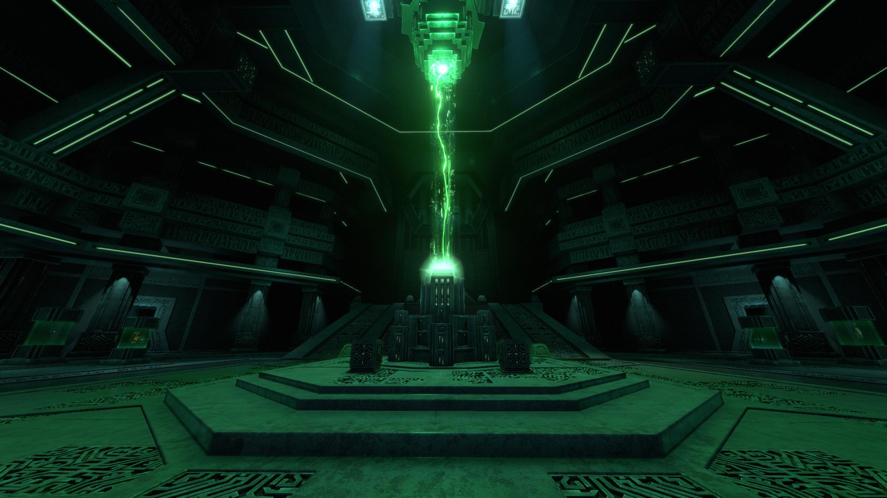

<h1>Fast Ion Cube Fabricator</h1>
A BepInEx mod for Subnautica that adjusts the speed of the Ion Cube Fabricator located in the Primary Containment Facility (Antechamber).
<a href="https://youtu.be/QDiysuM27jQ">Preview Video</a>

## Installation

1. Install [Tobey's BepInEx Pack for Subnautica](https://www.nexusmods.com/subnautica/mods/1108) (required)
2. Download the latest release from [Releases](https://github.com/xHeXifx/Fast-Ion-Cube-Fabricator/releases/latest) or [NexusMods](https://www.nexusmods.com/subnautica/mods/3470)
3. Extract the `FastIonProduction` folder into:
`{Subnautica}\BepInEx\plugins`
4. Launch the game
5. Adjust settings in-game using the [Configuration Manager for BepInEx](https://www.nexusmods.com/subnautica/mods/1112) (F5)

## Requirements

- [Tobey's BepInEx Pack for Subnautica](https://www.nexusmods.com/subnautica/mods/1108) (/ BepInEx) (required)
- Optional: [Configuration Manager for BepInEx](https://www.nexusmods.com/subnautica/mods/1112) for in-game config editing

⚠️ This mod will not function without BepInEx installed.

## Configuration

All settings can be modified via the in-game [Configuration Manager for BepInEx](https://www.nexusmods.com/subnautica/mods/1112) (F5 menu).
Default values are set to 10s

## Build from source

1. Pull latest repo using `git clone https://github.com/xHeXifx/Fast-Ion-Cube-Fabricator`
2. Run `dotnet build` (Or Ctrl+Shift+P and .NET: Build in VSCode)
3. Built file in `/bin/Debug/FastIonProduction.dll`

## Credits

- [BepInEx](https://github.com/BepInEx/BepInEx)
- [Harmony library](https://github.com/pardeike/Harmony)